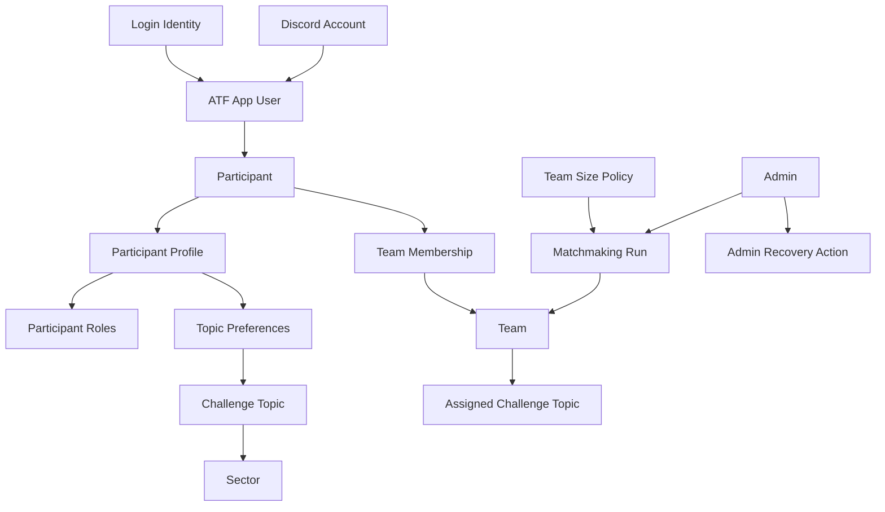

# ATF Challenge App

This folder captures the working product model for the authenticated ATF Challenge App intended for `app.atfchallenge.org`.

The app is expected to become its own repository later. Keep this folder portable: future agents and collaborators should be able to understand the product without relying on the current landing-page codebase.

## Status

This is an initial working model, not a finished build specification.

Decisions marked as accepted are stable enough to design against. Items in [open-questions.md](./open-questions.md) need more product discussion before implementation.

## Reading Order

1. [references.md](./references.md) explains the ATF Challenge context that currently lives in the landing-page repo.
2. [CONTEXT.md](./CONTEXT.md) defines the domain language.
3. [product-model.md](./product-model.md) summarizes the participant lifecycle and product rules.
4. [identity-and-verification.md](./identity-and-verification.md) covers email login, Discord verification, and recovery.
5. [team-formation-and-matchmaking.md](./team-formation-and-matchmaking.md) covers profiles, topic preferences, and team formation.
6. [admin-dashboard.md](./admin-dashboard.md) lists the admin dashboard surfaces discovered so far.
7. [architecture.md](./architecture.md) records the current technical shape.
8. [diagrams.md](./diagrams.md) collects the key Mermaid diagrams in one place.
9. [open-questions.md](./open-questions.md) tracks unresolved branches.

## Domain Model

## Accepted ADRs

- [ADR 0001: ATF App User is the canonical identity](./adr/0001-atf-app-user-is-canonical-identity.md)
- [ADR 0002: Use Discord HTTP interactions for the MVP](./adr/0002-discord-http-interactions-for-mvp.md)
- [ADR 0003: Use admin-reviewed matchmaking runs](./adr/0003-admin-reviewed-matchmaking-runs.md)

