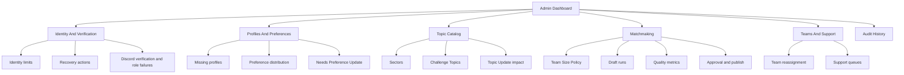

# Admin Dashboard

The admin dashboard should make worst-case operational scenarios visible and recoverable without making recovery actions feel routine.

## Principles

- Admin actions must be auditable.
- Recovery actions require a reason.
- Destructive-looking actions should require confirmation.
- Admins should see impact counts before making catalog changes.
- The dashboard should prefer stable IDs internally while showing human-readable Discord names where useful.
- Discord username or display name is never the durable identifier. Use Discord User ID and ATF App User ID behind the scenes.

## Counted Admin Surfaces

1. Users at the Login Identity limit and failed Login Identity attach attempts.
2. Login Identity Reset history and users with no active Login Identities.
3. Discord Account Recovery history.
4. Sector and Challenge Topic catalog management.
5. Matchmaking review and approval.
6. Team change requests and manual Team reassignment.
7. Participants missing profile completion.
8. Topic Preference distribution by Sector and Challenge Topic.
9. Participant Role list visibility or configuration reference.
10. Topic Update impact preview.
11. Participants with fewer than two active Topic Preferences.
12. Topic Update history.
13. Topic archive or merge impact reports.
14. Pre-matchmaking eligibility summary.
15. Team Size Policy and projected Team count calculator.
16. Matchmaking Run history with frozen policy snapshots.
17. Draft Matchmaking Run comparison.
18. Matchmaking quality and coverage metrics.
19. Publish Teams action.
20. Discord `Verified Participant` role assignment failures.

## Dashboard Grouping

## Identity Recovery Guardrails

Both Login Identity Reset and Discord Account Recovery are Admin Recovery Actions. They should:

- Preserve the ATF App User.
- Preserve team memberships, submissions, progress, and audit history.
- Record admin, timestamp, reason, old values, and new values.
- Notify the user where possible.
- Require the user to complete fresh login and verification where appropriate.

## Matchmaking Review Metrics

Draft Matchmaking Run review should show:

- Number of Participants included.
- Number of Participants excluded.
- Number of Participants in Needs Preference Update.
- Number of Teams generated.
- Team size distribution.
- Topic match quality.
- Sector fallback usage if enabled.
- Role balance distribution.
- Country distribution.
- Unmatched Participants.
- Warnings and exceptions.

## First Admin MVP

The full dashboard can be staged. The first admin MVP should prioritize:

- Identity attach failures.
- Login Identity cap reports.
- Topic catalog management with impact preview.
- Participants missing profile completion.
- Participants with fewer than two active Topic Preferences.
- Team Size Policy calculator.
- Draft Matchmaking Run review and approval.
- Audit history for recovery actions and publish actions.

