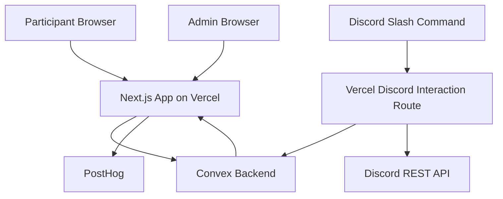
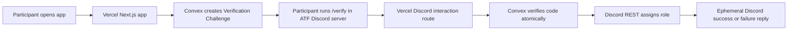

# Architecture

The current architecture direction is optimized for a scalable MVP with minimal moving parts.

## Proposed System Boundary

## MVP Technology Decisions

- Next.js on Vercel for the web app.
- Convex for durable backend state and realtime app state.
- PostHog for analytics.
- Discord HTTP slash-command interactions for the verification MVP.
- Discord REST API calls for actions such as assigning the `Verified Participant` role.
- Persistent Discord bot process is a fallback or later phase, not the launch default.

## Discord Interaction Shape

Important constraints:

- Discord interactions can be delivered by outgoing webhook rather than a persistent Gateway client.
- Discord requires the application to send an initial interaction response within 3 seconds of receiving the event.
- That 3-second rule applies after the user runs the slash command. It is not the expiry window for the web-generated verification code.
- The app should reject interactions that do not come from the official ATF Discord server ID.

## Convex State Responsibilities

Convex should own:

- ATF App Users.
- Login Identities.
- Discord Account links.
- Verification Challenges.
- Participant Profiles.
- Sectors and Challenge Topics.
- Topic Preferences.
- Team Size Policies.
- Matchmaking Runs.
- Teams and Team Memberships.
- Admin Recovery Actions and audit history.

Verification and linking should be atomic and idempotent. Key records should be indexed by stable identifiers such as ATF App User ID, Login Identity, Discord User ID, Challenge Topic ID, and Matchmaking Run ID.

## Vercel Responsibilities

Vercel should own:

- The Next.js participant and admin UI.
- Route handlers for Discord interactions.
- Discord request signature verification.
- Short request-response orchestration around Convex calls.

The Discord interaction route should respond quickly. If a future command becomes slow, the route should defer the interaction and send a follow-up response within Discord's supported interaction-token window.

## PostHog Event Areas

The app should track product analytics without leaking sensitive information.

Candidate event areas:

- Login started.
- Verification challenge generated.
- Discord verification command received.
- Discord verification completed.
- Verification failed by reason category.
- Participant profile completed.
- Topic Preferences submitted.
- Participant entered Needs Preference Update.
- Draft Matchmaking Run generated.
- Matchmaking Run approved.
- Teams published.
- Admin Recovery Action performed.

Avoid sending raw verification codes or full email addresses to analytics.

## Persistent Bot Fallback

A persistent Discord bot process may be justified later if the app needs:

- Gateway events such as member joins.
- Richer role or moderation automation.
- Ongoing server monitoring.
- Real-time behavior not initiated by slash commands.
- Direct message workflows that are explicitly approved later.

The MVP should avoid a persistent bot process unless HTTP interactions cannot deliver the required user experience.

## Sources Checked

- Discord interactions: https://docs.discord.com/developers/interactions/receiving-and-responding
- Vercel Functions: https://vercel.com/docs/functions
- Convex HTTP Actions: https://docs.convex.dev/functions/http-actions

