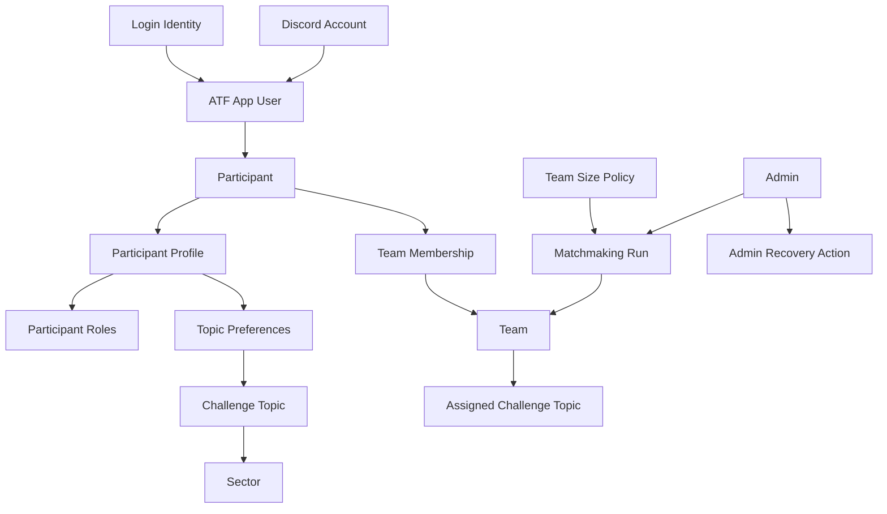
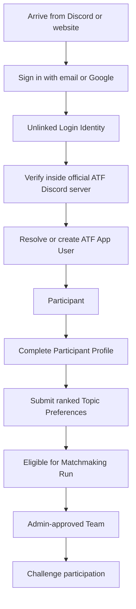
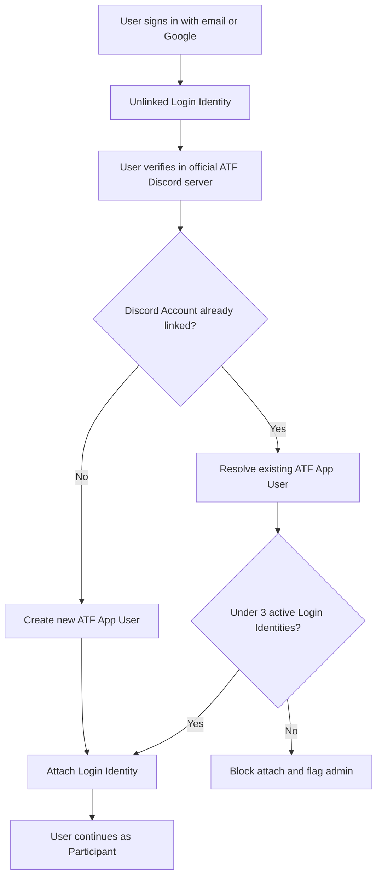
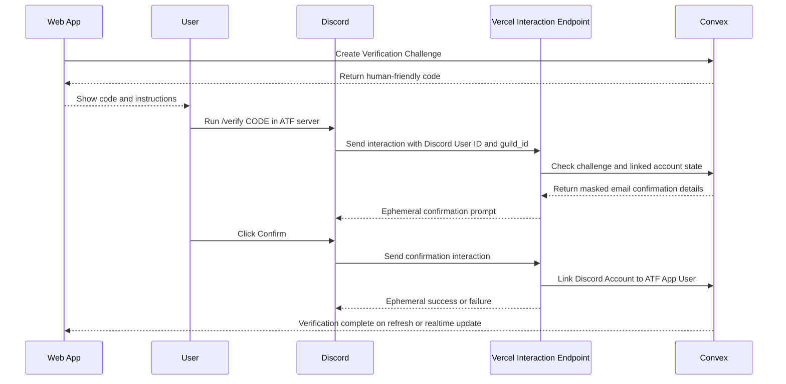
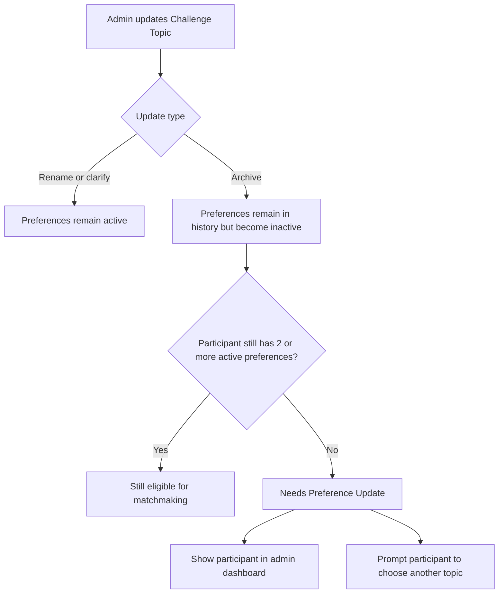
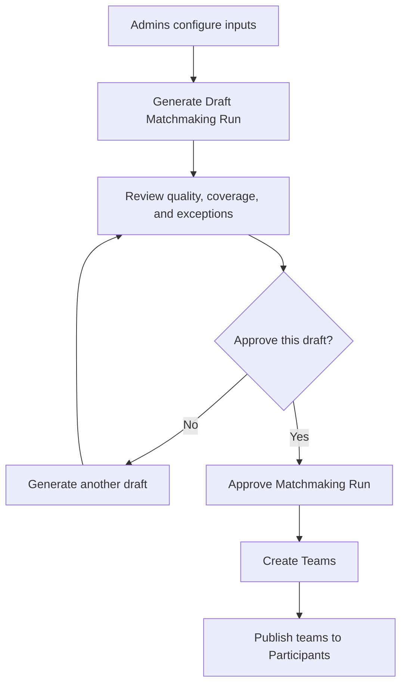
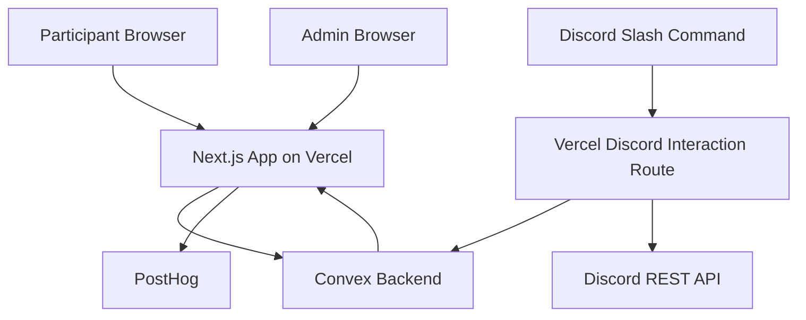
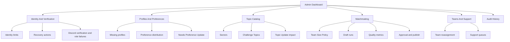

# Diagrams

This file collects the key diagrams for visual review. The same diagrams may also appear inline in the focused docs.

## Domain Model

## Participant Lifecycle

## Identity Resolution

## Discord Verification

## Topic Update Impact

## Matchmaking Run Lifecycle

## Architecture Boundary

## Admin Dashboard Grouping

