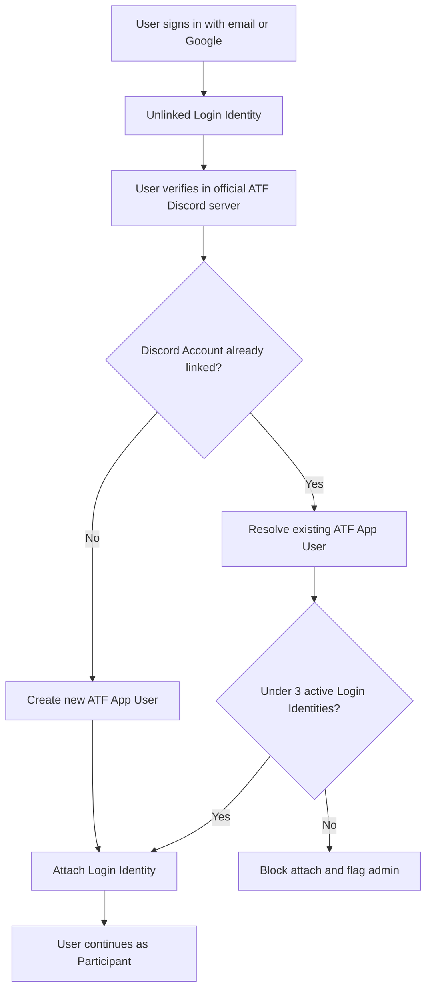
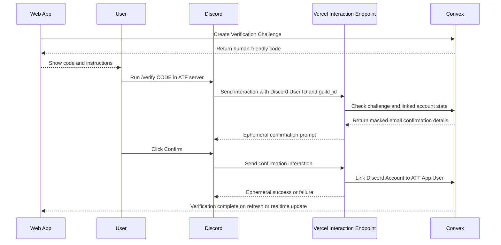
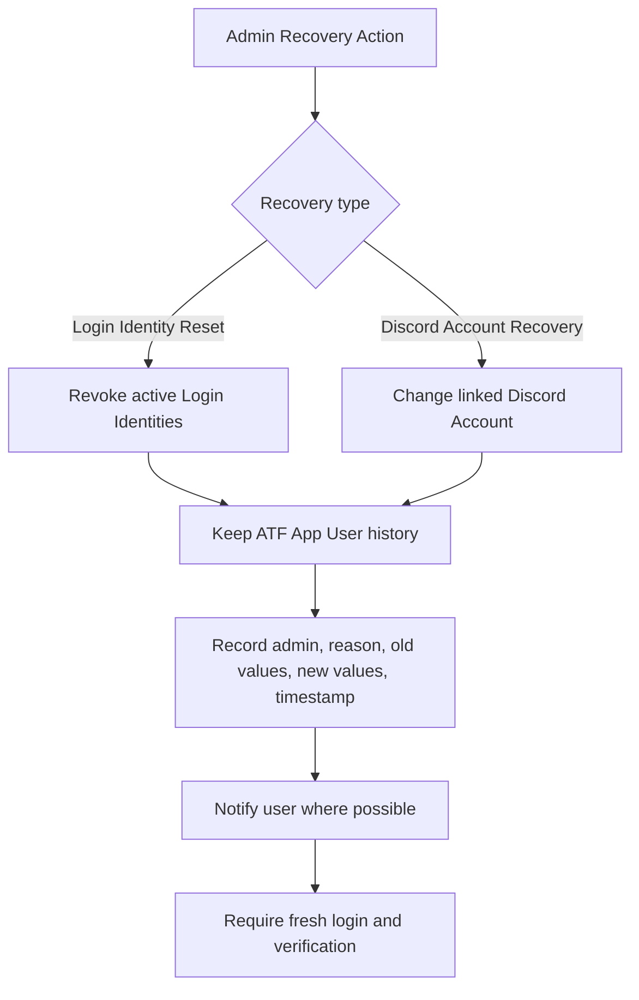

# Identity And Verification

The identity model is designed to prevent duplicate participant records while allowing realistic access recovery. Participants may sign in with different email addresses over time, but Discord verification resolves those sign-ins back to the canonical ATF App User.

## Core Model

## Verification Flow

## Verification Rules

- A Verification Challenge expires after 10 minutes.
- Refreshing or regenerating a Verification Challenge creates a new active code and invalidates the previous one.
- The Discord slash command must only work inside the official ATF Discord server.
- The interaction must include the expected official server ID.
- DM and private-channel verification are not allowed.
- The Discord confirmation should show a tastefully masked email address.
- A second typed code is not required because it would prove the same web-session control again.
- After successful verification, the system should assign a Discord role such as `Verified Participant`.

## Email Masking

The confirmation message should reveal enough of the email to be recognizable without showing the full address in Discord.

Recommended masking:

- Show the domain fully.
- For local parts with 1 to 4 characters, show the first character and mask the rest.
- For local parts with 5 to 8 characters, show the first two characters and the last character.
- For local parts with 9 or more characters, show the first three characters and the last two characters.

Examples:

- `matt.pocock@gmail.com` becomes `mat******ck@gmail.com`.
- `ama@yahoo.com` becomes `am*@yahoo.com`.

## Login Identity Cap

An ATF App User can have at most three active Login Identities.

When adding the third active Login Identity:

- Allow it.
- Warn the Participant that they have reached the maximum.
- Show where linked sign-in emails can be managed.

When attempting a fourth active Login Identity:

- Do not attach the new Login Identity.
- Do not let the user continue into the app through that new Login Identity.
- Tell the user to sign in with an existing linked email, remove an email from account settings, or contact support.
- Flag the attempt for admins.
- Keep an audit record for support.

## Removing A Login Identity

Removing a Login Identity should require an authenticated session from an existing linked Login Identity. Discord verification alone should not be enough to remove existing login methods, because a compromised Discord Account would then be able to weaken account recovery.

## Admin Recovery

Two Admin Recovery Actions are accepted:

- Login Identity Reset: revoke active Login Identities while keeping the same Discord Account and ATF App User.
- Discord Account Recovery: change the Discord Account linked to an ATF App User while preserving participant history.

Both actions are available to Admins. There is no separate admin hierarchy planned at this stage.

## Admin Flags

Identity-related admin surfaces are listed in [admin-dashboard.md](./admin-dashboard.md). The highest-priority items are:

- Users at the Login Identity cap.
- Failed Login Identity attach attempts.
- Login Identity Reset history.
- Discord Account Recovery history.
- Users with no active Login Identities after recovery.
- Discord role assignment failures after verification.

