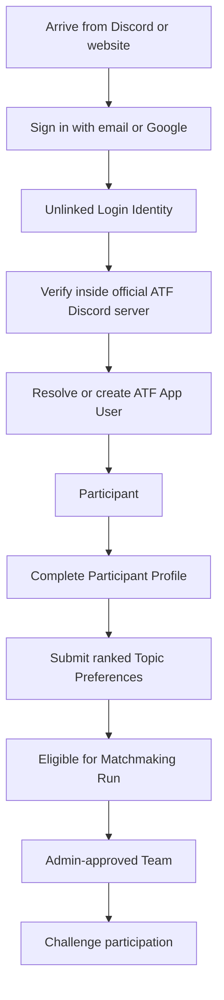

# Product Model

The ATF Challenge App exists to move participants from a Discord announcement into a verified, profile-complete, team-ready state at a scale that would be difficult to manage manually in Discord.

## Product Boundary

The app is intended for `app.atfchallenge.org`.

The public website can continue to explain the program and route applicants. The app owns authenticated participant workflows, team formation, admin review, and operational support.

## Participant Lifecycle

## Accepted Product Rules

- The ATF App User is the canonical identity.
- A Login Identity is not the canonical participant identity.
- A Discord Account is required before a user becomes a Participant.
- Verification must happen inside the official ATF Discord server.
- A Participant can have multiple Login Identities, capped at three active identities.
- A Participant can belong to at most one active Team per Cohort.
- A Participant must complete a Participant Profile after verification.
- A Participant chooses one Primary Role and up to two Secondary Roles.
- Participant Roles are config-managed at launch, not admin-editable in the dashboard.
- Sectors and Challenge Topics are admin-managed content.
- Topic Preferences are ranked.
- Participants must choose at least two and at most three Topic Preferences.
- Topic Preferences must come from distinct Sectors.
- Challenge Topics have stable IDs.
- A Topic Update does not rewrite historical Topic Preferences.
- Archiving a Challenge Topic can make a Topic Preference inactive for matchmaking.
- Participants with fewer than two active Topic Preferences enter Needs Preference Update.
- Admins decide how to handle Needs Preference Update participants before matchmaking.
- Teams are system-formed and admin-approved, not user-created.
- Team Size Policy is cohort-specific and admin-configured.
- The current target Team size is four, based on historical ATF practice.
- Team Size Policy is frozen into each Approved Matchmaking Run.
- Admins can generate multiple Draft Matchmaking Runs before approving one.
- Topic preference should outrank role balance in matchmaking.
- Teams should have one Assigned Challenge Topic where possible.

## User-Facing Explanation

Keep the participant explanation simpler than the internal model:

> Sign in with email, then verify your Discord. Your Discord connects you to your ATF Challenge account, so you can recover access even if you use a different email later.

For team formation:

> Complete your profile and rank your topic preferences. ATF will use this information to form balanced teams around shared interests.

## Needs More Information

The Sector-level fallback branch is unresolved:

- A Matchmaking Run may allow Sector-level fallback when exact Challenge Topic matches are sparse.
- It is not yet decided how a Team formed through Sector-level fallback gets its final Assigned Challenge Topic.

Track this in [open-questions.md](./open-questions.md).

