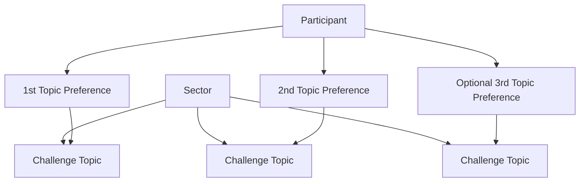
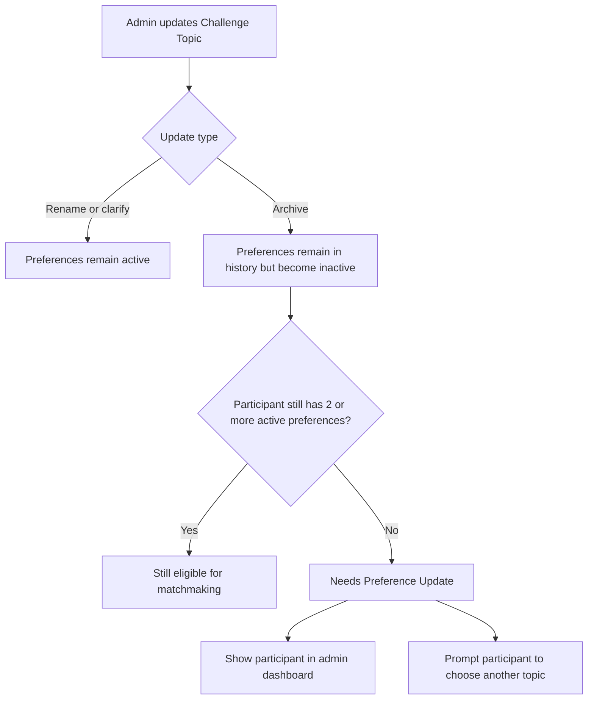
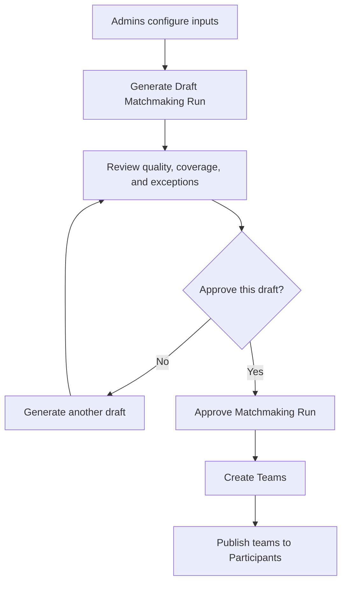

# Team Formation And Matchmaking

Teams are formed by the system and approved by admins. Participants do not create or browse teams themselves during the primary team-formation flow.

## Profile Completion

After Discord verification, a Participant must complete a Participant Profile before they can be considered ready for matchmaking.

The initial profile should capture:

- Country.
- Primary Role.
- Up to two Secondary Roles.
- Ranked Topic Preferences.

Initial Participant Role options:

- Builder/Engineer.
- Designer/Product.
- Data/AI.
- Research/Domain.
- Business/Growth.
- Storytelling/Pitch.

Roles are config-managed at launch. Existing selections should remain historically readable if the role list changes later.

## Sector And Challenge Topic Catalog

Admins manage Sectors and Challenge Topics.

Rules:

- A Challenge Topic has a stable unique ID.
- The display text can be edited for clarity without changing the Topic Preference.
- Archiving a Challenge Topic keeps historical Topic Preferences but makes them inactive for matchmaking.
- Participants must have at least two active Topic Preferences before matchmaking unless admins decide otherwise.
- Admins should see how many Participants are affected before saving a Topic Update.

## Topic Update Impact

Participants with fewer than two active Topic Preferences are not automatically excluded. Admins decide what to do after seeing the count and the affected list.

Admin options before matchmaking:

- Pause and ask those Participants to update preferences.
- Include them manually.
- Exclude them from the current Matchmaking Run.

## Team Size Policy

Team Size Policy is cohort-specific and admin-configured.

Historical ATF practice is teams of four, so the current default target Team size is four.

The admin dashboard should show real-time projections:

- Participant count divided by target Team size.
- Estimated number of Teams.
- Remainders and overflow cases.
- Estimated Teams per Sector or Challenge Topic.
- Warnings when minimum, target, and maximum values make matching difficult.

Once a Matchmaking Run is approved, its Team Size Policy is frozen into that Approved Matchmaking Run.

## Matchmaking Run Lifecycle

Admins can generate multiple Draft Matchmaking Runs before approving one. Drafts should preserve inputs and outputs for comparison.

## Matchmaking Priorities

The current recommended priority order is:

1. Valid Team size according to Team Size Policy.
2. Shared or compatible Challenge Topic preference.
3. Role balance.
4. Country and time-zone distribution.
5. Avoid isolating underrepresented roles or countries.
6. Randomized fair tiebreakers.

Topic preference should beat role balance. A balanced team on a topic no one cares about is less valuable than an imperfectly balanced team with shared motivation.

## Team Change After Formation

After Teams are formed, Participants who need to change Teams should contact a mentor or Admin. The Admin performs the reassignment.

Open details:

- Whether mentors can request but not execute team changes.
- What evidence or reason is required.
- Whether team changes are blocked after a specific challenge milestone.

## Needs More Information

Sector-level fallback is accepted as a possible Matchmaking Run setting, but the final topic-selection flow is unresolved.

Open question:

- If a Team is formed around a Sector rather than an exact Challenge Topic, how does it get its final Assigned Challenge Topic?

